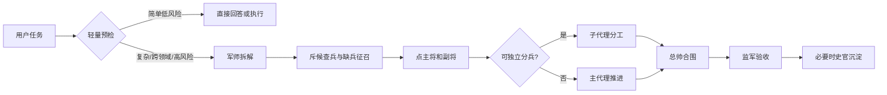

# codex-skill-army｜技之军团

[](https://github.com/KW-Zh/codex-skill-army/actions/workflows/validate.yml)
[](LICENSE)
[](CHANGELOG.md)

Research-first multi-agent orchestration protocol for OpenAI Codex skills.

一个面向科研工作流的 Codex 单体 skill：用“军制”统领本地已有和未来新增的 skills，帮助 Codex 在论文、文献综述、Word 学术排版、科研代码、Abaqus/仿真、技能征召和多代理协作中做出清晰调度。

它是“总控 skill”，不是论文、Word、Abaqus、代码图谱能力的合集。真正的专业交付仍由用户本地安装的领域 skills、MCP 和工具完成，`codex-skill-army` 负责判断该派谁、何时分兵、如何验收。

## 核心亮点

- 军制调度：用总帅、军师、斥候、主将、副将、监军、军需官、史官、工部九类角色组织复杂任务。
- 动态点将：优先读取当前 Codex 会话可见的 skills metadata；未来新增 skill 只要可见，也能进入调度。
- 科研优先：把文献、引用、Word 公式、科研代码、Abaqus/FEA、长期记忆和隐私边界放在同一套验收协议里。
- 防过度流程：简单问题直接回答，只有复杂、跨领域、长期或高风险任务才进入完整军制。
- 防风险扩散：缺兵征召默认只给建议，不默认安装外部 skill，不默认启用长期记忆，不默认覆盖或删除用户文件。

## 为什么需要它

科研任务通常不是单点问题，而是多个能力的组合：

- 读论文、查文献、核引用、写中文汇报。
- 写论文、生成 Word、处理公式编号、交叉引用和参考文献。
- 维护科研代码，理解大型代码库结构。
- 做 Abaqus/FEA 建模、边界条件、网格、结果提取。
- 长期项目需要记住研究偏好、格式要求和历史决策。

`codex-skill-army` 不把这些能力塞进一个巨大的说明书，而是提供一个总控协议：先判断，再点将，再分兵，最后验收。

## 适合与不适合

适合：

- 已经安装多个 Codex skills，希望让它们按任务自动组合。
- 科研写作、文献综述、Word 学术排版、科研代码、Abaqus/FEA 等跨工具任务。
- 需要子代理分工，但希望主代理保留最终合围和验收责任。
- 希望长期科研偏好可被谨慎沉淀，但不想默认泄露隐私或暴涨 token。

不适合：

- 只需要一个专业 skill 直接完成的单步任务。
- 希望本仓库自带论文检索、Office、Abaqus 或 CodeGraph 的完整实现。
- 希望跳过安全审计，自动安装未知来源 skill 或默认读取私人历史。

## 30 秒安装

从 GitHub 安装时，使用 Codex 的 skill installer 指向仓库根目录即可：

```powershell
py -3 "$env:USERPROFILE\.codex\skills\.system\skill-installer\scripts\install-skill-from-github.py" --repo KW-Zh/codex-skill-army --ref main --method download --path . --name codex-skill-army
```

安装后重启 Codex，然后用下面的提示验证是否生效：

```text
调用 $codex-skill-army：帮我判断“读 10 篇论文并生成中文综述”应该如何点将。
```

本地开发时，可直接把仓库复制到 Codex skills 目录：

```powershell
.\scripts\install-local.ps1 -WhatIf
.\scripts\install-local.ps1
```

本地安装脚本默认不覆盖已有文件。确需覆盖时会列出冲突文件，并要求 `-ConfirmOverwrite` 和手动输入 `YES`。

常见排查：

- 安装后没有触发：重启 Codex，并确认 `codex-skill-army` 出现在可见 skills 列表。
- Python 命令不可用：先确认本机已安装 Python 3，并使用系统可识别的 `py -3` 或 `python3`。
- 本地开发安装冲突：先运行 `.\scripts\install-local.ps1 -WhatIf` 查看目标文件，不要直接覆盖未知目录。

## 快速使用

```text
调用 $codex-skill-army：帮我读这几篇论文，做中文综述，并生成带引用的 Word 报告。
```

```text
调用 $codex-skill-army：这是个大科研代码库，先理解架构，再拆任务给子代理。
```

```text
调用 $codex-skill-army：我缺少某个软件的建模 skill，帮我找高分候选并审计。
```

## 完整调度样例

用户输入：

```text
调用 $codex-skill-army：帮我围绕“数据驱动的粘结滑移模型”做中文文献综述，并生成带引用的 Word 报告。
```

预期调度令：

```text
主线：交付中文文献综述和 Word 报告。
军师：先确定研究范围、关键词、纳入排除标准和报告结构。
斥候：如本地缺少论文检索或 Word 公式能力，输出征召令。
主将：文献检索/阅读/综述类 skill。
副将：citation、scientific-writing、office/docx、pdf。
分兵：检索、阅读、报告结构可并行；最终由主代理合围。
监军：核验 DOI/引用、Word 排版、公式编号和图表标题。
史官：仅保存用户确认的研究方向和格式偏好。
```

输出片段：

```text
先把文献分成试验模型、数值模型、数据驱动模型三类，再给出关键论文表和研究空白。引用无法核验的条目会单独标注，不混入确定结论。
```

## 九角色军制

| 角色 | 职责 |
| --- | --- |
| 总帅 | 统一调度、点将、分兵、合围、验收 |
| 军师 | 目标澄清、路线选择、任务拆解 |
| 斥候 | 搜索 skills、审计来源、输出征召令 |
| 主将 | 负责交付物核心规则的领域 skill |
| 副将 | 检索、格式、图表、验证、部署等补位 |
| 监军 | 质量、安全、隐私、引用、测试检查 |
| 军需官 | 盘点技能库、维护能力地图 |
| 史官 | 长期记忆，推荐 agentmemory |
| 工部 | CodeGraph、MCP、CLI、安装器和自动化 |



## 与其他方式的区别

| 方式 | 适合什么 | 局限 |
| --- | --- | --- |
| 普通 prompt | 单次、低风险、边界清楚的问题 | 缺少稳定点将、分兵和验收协议 |
| 单一专业 skill | Word、Abaqus、PDF 等单领域任务 | 跨领域任务需要人工组合 |
| skills catalog | 查找或安装大量 skills | 不负责每轮任务调度和质量验收 |
| `codex-skill-army` | 科研向多 skill、多代理、多阶段任务 | 不替代领域 skill 的专业实现 |

## 史官集成

推荐使用 `agentmemory` 作为史官，但本项目不把它作为硬依赖。建议保守配置：

- 只保存用户确认的长期科研偏好和项目决策。
- 不默认保存原始论文全文、凭据、聊天隐私或个人敏感信息。
- 不默认自动压缩和自动上下文注入，避免 token 消耗不可控。

不安装史官也可以使用本 skill；此时长期偏好需要由用户在当前对话或项目说明中显式提供。

## 第三方工具

`agentmemory`、CodeGraph、Codex skill installer 和其他领域 skills 都是可选外部工具，遵守各自许可证。本仓库只提供调度协议和示例，不重新分发这些项目的源码，也不复制第三方 skill 的正文、脚本或示例。

## CI

仓库提供 GitHub Actions 工作流：`.github/workflows/validate.yml`。它会运行结构检查、隐私扫描、内容审计、防侵权来源审计、压力测试、安装脚本 dry-run 和 `quick_validate.py`，用于保护发布质量。

## 开发验证

```powershell
py -3 .\scripts\check_structure.py .
py -3 .\scripts\privacy_scan.py .
py -3 .\scripts\content_audit.py .
py -3 .\scripts\source_audit.py .
py -3 .\scripts\run_pressure_tests.py .
py -3 .\scripts\quick_validate_ci.py .
py -3 -X utf8 "$env:USERPROFILE\.codex\skills\.system\skill-creator\scripts\quick_validate.py" .
```

## 路线图与分享

- 路线图：见 [docs/roadmap.md](docs/roadmap.md)。
- 项目介绍素材：见 [docs/share-kit.md](docs/share-kit.md)。
- 快速安装说明：见 [docs/quick-start.md](docs/quick-start.md)。

## 许可证

MIT。第三方工具和可选集成遵守其各自许可证。
