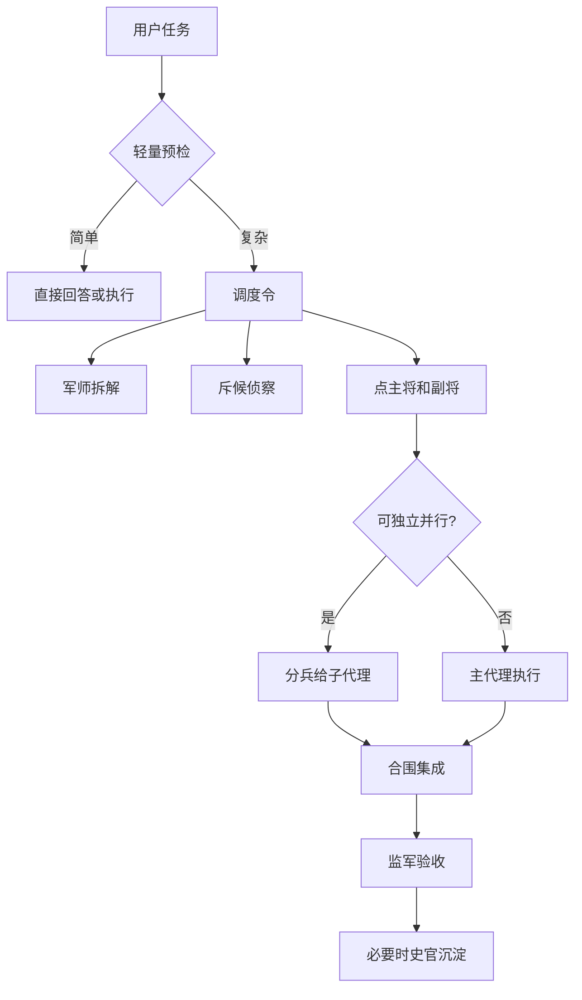

# 架构说明

`codex-skill-army` 是单体 skill，不是技能合集。它的价值在于调度协议：

```mermaid
flowchart TD
    A["用户任务"] --> B{"轻量预检"}
    B -->|简单| C["直接回答或执行"]
    B -->|复杂| D["调度令"]
    D --> E["军师拆解"]
    D --> F["斥候侦察"]
    D --> G["点主将和副将"]
    G --> H{"可独立并行?"}
    H -->|是| I["分兵给子代理"]
    H -->|否| J["主代理执行"]
    I --> K["合围集成"]
    J --> K
    K --> L["监军验收"]
    L --> M["必要时史官沉淀"]
```

## 设计原则

- 不替代专业 skill。
- 不硬编码用户本地技能表。
- 不为简单任务引入流程。
- 科研场景优先证据链、可复现和格式约束。
- 长期记忆默认保守，避免隐私和 token 风险。
